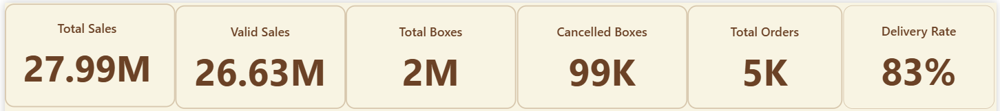
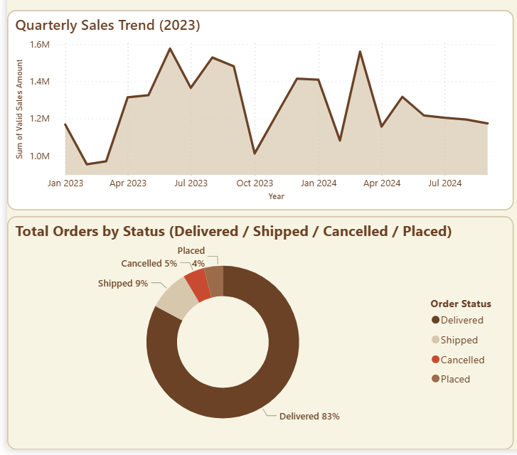
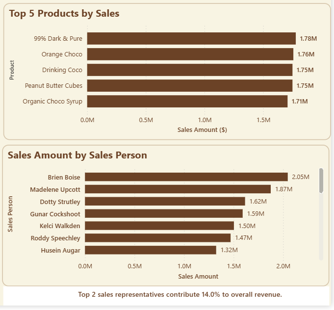
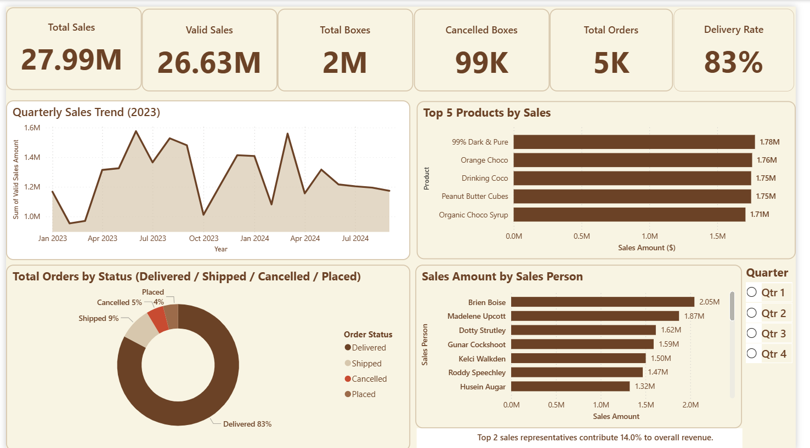

# 🍫 Chocolate Sales Power BI Dashboard

## 📊 Project Overview
This is my **first Power BI project**, built as part of my data analysis learning journey.  
The project showcases an **end-to-end analysis process** using Power BI — from dataset sourcing and cleaning in Excel  
to creating a professional dashboard with key business insights.

The dataset represents chocolate sales data collected from GitHub, cleaned and prepared in Excel,  
and finally transformed into an interactive Power BI dashboard.

---

## 🧾 Dataset Details
- **Source:** GitHub (Chocolate Sales Dataset)  
- **Preparation:** Excel (Data cleaning, formatting, and KPI calculation)  
- **Visualization:** Power BI (Interactive Dashboard)

---

## ⚙️ Tools & Technologies
- **Microsoft Excel** → Data cleaning & preprocessing  
- **Power BI Desktop** → Data modeling, DAX measures, and dashboard visualization  
- **GitHub** → Project hosting and portfolio sharing

---

## 💵 Currency Used
- **Currency:** USD ($)  
*(For international portfolio visibility. Local dashboards can use PKR (₨) as needed.)*

---

## 📈 Key Insights
1. **Total Sales:** $27,990,857  
2. **Delivery Rate:** 83%  
3. **Top 2 Sales Representatives** contribute **~15%** to overall revenue  
4. **Sales Trend:** Noticeable increase in mid-year period  
5. **Order Status Distribution:** Delivered orders dominate with a minor cancelled rate  

---

## 🎨 Dashboard Design
- Clean, minimalist beige background  
- Rounded visuals (radius = 12)  
- Line chart with soft shaded area  
- Donut and bar charts for categorical insights  
- KPI cards highlighting major metrics (Sales, Delivery Rate, Orders)

---

## 💡 Insights Summary
This dashboard helps track:
- **Overall revenue performance**
- **Salesperson contribution**
- **Delivery success rate**
- **Monthly sales trends**

---

## 🚀 Future Improvements
- Add slicers for **region, product type, and time period**
- Integrate with **live database** or Power BI Service refresh  
- Include **profit margin** and **return rate** metrics  
- Enhance visuals with **dynamic tooltips**

---

## 🧠 Author
**Muhammad Azeem**  
Data Analyst | Power BI Developer  
📍 Pakistan  
🔗 [LinkedIn Profile](https://www.linkedin.com/in/)

---

## 📸 Dashboard Screenshots

### KPI Overview

### Sales Trend & Order Status

### Top 5 Products & Salesperson

### Full Dashboard Layout

